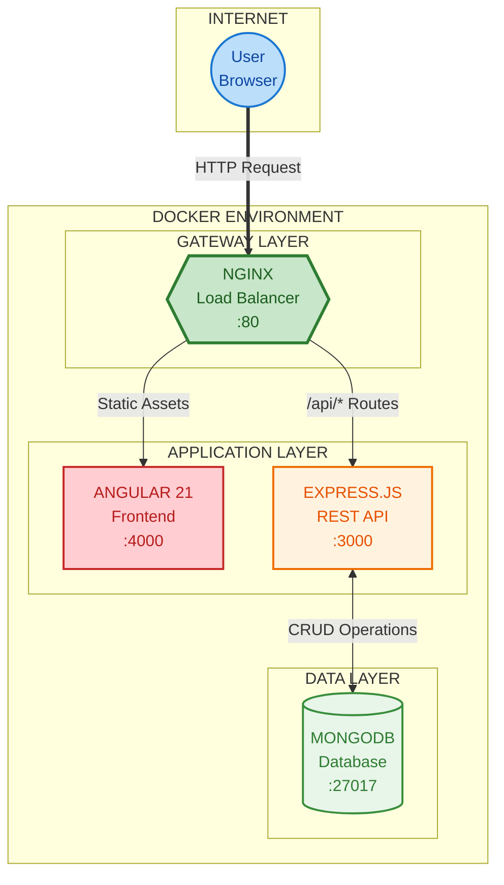
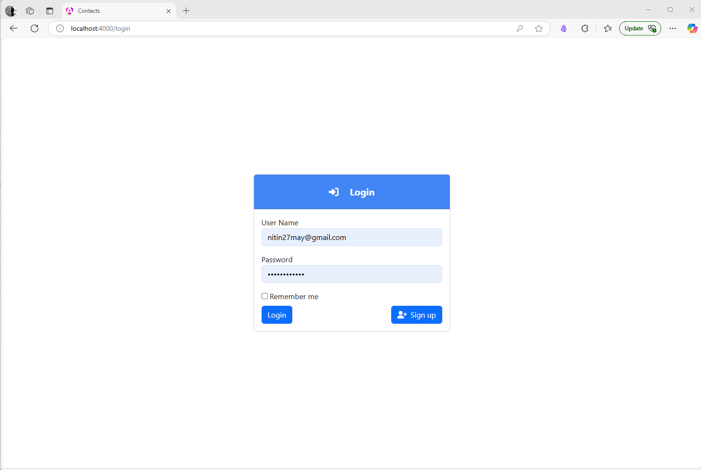

<div align="center">

# MEAN Stack Contact Manager — Pushkar Wani

### Production-Ready Full-Stack Application

**MongoDB** | **Express.js** | **Angular 21** | **Node.js** | **Docker**

**A modern, containerized contact management system demonstrating best practices in full-stack TypeScript development**

[Get Started](#getting-started) | [Documentation](#documentation)

**GitHub:** [2015pushkar](https://github.com/2015pushkar) | **Email:** pushkarwani63@gmail.com

</div>

---

## Table of Contents

- [Why This Project](#why-this-project)
- [For Engineering Managers](#for-engineering-managers)
- [What the Application Does](#what-the-application-does)
- [Skills Covered](#skills-covered)
- [Architecture](#architecture)
- [Tech Stack](#tech-stack)
- [Getting Started](#getting-started)
- [Deployment Modes](#deployment-modes)
- [Features](#features)
- [Documentation](#documentation)
- [Roadmap](#roadmap)
- [Contributing](#contributing)
- [License](#license)

---

## Why This Project

The motivation behind building this was to understand what a **production-level system** actually looks like end-to-end — not just writing features, but wiring together every layer that a real deployed application depends on: containerization, reverse proxying, JWT-secured APIs, CI/CD pipelines, typed data models, and environment-aware configuration.

The domain is intentionally simple (a contact manager) so nothing distracts from the architecture underneath. Think of it as the **"Hello World" of production-grade full-stack apps**: simple enough that you're not lost in business rules, complex enough underneath that you're learning real patterns used in industry.

This project maps directly to the MEAN stack skill set required for modern full-stack roles — TypeScript across the entire stack, Angular 21 on the frontend, Express.js REST APIs on the backend, MongoDB for persistence, Docker for containerization, and GitHub Actions for CI/CD.

---

## For Engineering Managers

**What this project demonstrates at a glance:**

This is a fully containerized, TypeScript-first MEAN stack application built to production standards. It ships with four Docker containers (Angular frontend, Express.js API, MongoDB, Nginx gateway), a CI/CD pipeline via GitHub Actions, and environment-specific Docker Compose configurations for development and production modes.

**Architecture highlights:** A single Nginx entry point routes all traffic — static assets go to Angular, `/api/*` requests proxy to Express. No service is directly exposed except through the gateway. Containers are networked internally. This mirrors how microservices are structured in real production environments.

**Engineering discipline on display:** TypeScript is used across the full stack with proper interfaces and type safety. Authentication is JWT-based with route guards on the frontend and middleware-protected endpoints on the backend. The MongoDB schema uses Mongoose ODM with proper data modeling. The project includes separate dev and prod compose files, `.env`-driven configuration, and a roadmap covering testing, RBAC, Redis caching, and Kubernetes deployment.

**Why a contact manager?** Deliberately. The business domain stays out of the way so the focus is architecture, tooling, and the patterns that transfer to any domain — user auth, CRUD operations, search/sort/pagination, form validation, responsive UI, and deployment. The same patterns that run a contact list run a CRM, a task manager, or an inventory system.

---

## What the Application Does

A user opens the site and sees a login screen. They can register a new account or sign in with email and password. Once logged in, they land on a contacts page where they can:

- **Add contacts** — name, email, phone, address fields with validation
- **List contacts** — paginated table with search and sort
- **View contact details** — full detail page for each contact
- **Edit any field** — in-place editing with form validation
- **Delete contacts** — with confirmation
- **Change password** — from the account settings

The closest commercial analogies are Google Contacts, the phone's native contacts app, or the contacts section of a stripped-down CRM like HubSpot. Same shape, minimal implementation. The point is never the domain — it's the architecture underneath it.

---

## Skills Covered

### Direct hits on MEAN stack requirements
- **Full MEAN stack** — MongoDB, Express.js, Angular 21, Node.js, all wired together
- **TypeScript** across both frontend and backend
- **JWT authentication** with token-based API authorization and protected Angular routes
- **RESTful APIs** with Express — routing, middleware, request validation
- **RxJS** reactive patterns for handling async data flows in Angular

### Architecture patterns
- **Docker + Docker Compose** — four-container setup (frontend, API, database, Nginx)
- **Nginx reverse proxy** — single entry point, gateway separation from app services
- **Modularity and scalability** visible in container design and config
- **Angular standalone components**, signals, and modern control flow (Angular 21)
- **Bootstrap 5** for responsive desktop and mobile design

### Database
- **MongoDB with Mongoose** — schema design, CRUD, repository patterns
- **Data modeling** for users and contacts
- **Search, sort, and pagination** — builds intuition for query optimization

### DevOps and CI/CD
- **Docker and Docker Compose** for containerization (dev + prod configs)
- **GitHub Actions** CI/CD pipeline — build steps, automated checks
- **Nginx** production deployment configuration
- **Multi-environment config** — dev vs. prod compose files

### Gaps (honest accounting)
This project covers roughly 70% of a typical senior MEAN stack JD. What it does **not** include: Kafka/event-driven architecture, Redis caching (Q4 roadmap), WebSockets, comprehensive automated tests (Q1 roadmap), or microfrontend patterns. These are the areas to build on top of this as additional features.

---

## Architecture

<div align="center">



</div>

### How It Works

| Layer | Component | Responsibility |
|:-----:|-----------|----------------|
| **Gateway** | Nginx | Single entry point on port 80. Routes traffic and serves as reverse proxy |
| **Frontend** | Angular 21 | Serves the user interface with reactive components and Bootstrap 5 styling |
| **Backend** | Express.js | Handles API requests, authentication, and business logic |
| **Data** | MongoDB | Persists user accounts and contact information |

### Request Routing

| Request Path | Routed To | Description |
|:-------------|:----------|:------------|
| `/*` | Angular :4000 | Static frontend assets and SPA routes |
| `/api/*` | Express :3000 | REST API endpoints |
| Database | MongoDB :27017 | Data persistence (internal only) |

---

## Tech Stack

<table>
<tr>
<td width="25%" valign="top">

### Frontend
- Angular 21
- TypeScript
- Bootstrap 5
- RxJS
- Router Guards

</td>
<td width="25%" valign="top">

### Backend
- Node.js
- Express.js
- TypeScript
- Mongoose ODM
- JWT Auth

</td>
<td width="25%" valign="top">

### Database
- MongoDB 7.0
- Mongoose
- Data Seeding

</td>
<td width="25%" valign="top">

### DevOps
- Docker
- Docker Compose
- Nginx
- GitHub Actions

</td>
</tr>
</table>

---

## Getting Started

### Prerequisites

- [Docker](https://www.docker.com/get-started/) and Docker Compose
- [Git](https://git-scm.com/downloads)

### Quick Start

```bash
# 1. Clone the repository
git clone https://github.com/2015pushkar/mean-stack-dockerized
cd mean-stack-dockerized

# 2. Create environment file
cp .env.example .env

# 3. Start the application
docker-compose -f docker-compose.nginx.yml up
```

> **Ready in under 2 minutes!** Open [http://localhost](http://localhost) in your browser.

### Default Login

```
Email:    pushkarwani63@gmail.com
Password: P@ssword#321
```

---

## Deployment Modes

<table>
<tr>
<td width="50%">

### Development Mode

3 containers running on separate ports.

```bash
docker-compose up
```

| Service | URL |
|---------|-----|
| Frontend | http://localhost:4000 |
| API | http://localhost:3000 |
| Database | localhost:27017 |

</td>
<td width="50%">

### Production Mode

4 containers with Nginx gateway.

```bash
docker-compose -f docker-compose.nginx.yml up
```

| Service | URL |
|---------|-----|
| Application | http://localhost |
| Database | localhost:27017 |

</td>
</tr>
</table>

---

## Features

<table>
<tr>
<td width="50%">

### Authentication

- JWT-based secure login and registration
- Protected routes with Angular guards
- Token-based API authorization
- Password change functionality

</td>
<td width="50%">

### Contact Management

- Create, read, update, and delete contacts
- Responsive design for mobile and desktop
- Form validation with custom error messages
- Search, sort, and paginate contacts

</td>
</tr>
</table>

<p align="center">
  
</p>

---

## Documentation

| Document | Description |
|:---------|:------------|
| [Frontend](frontend/README.md) | Angular application architecture and components |
| [Backend API](api/README.md) | Express.js endpoints and middleware |
| [Database](docs/mongo-readme.md) | MongoDB schemas and data models |
| [Load Balancer](loadbalancer/README.md) | Nginx routing configuration |
| [Local Development](docs/local-devlopment.md) | Running without Docker |
| [Docker Guide](docs/docker-guide.md) | Container setup and configuration |

---

## Roadmap 2026

| Quarter | Focus Area | Goals |
|:-------:|:-----------|:------|
| Q1 | Testing & Quality | Unit tests, E2E tests with Cypress, code coverage reporting |
| Q2 | UI Modernization | Angular Material integration, dark/light theme, responsive redesign |
| Q3 | Security & Access | Role-based access control (Admin, Manager, User), OAuth 2.0 support |
| Q4 | Performance & Scale | Redis caching, API rate limiting, Kubernetes deployment configs |

See the [complete roadmap](docs/roadmap.md) for details.

---

## Contributing

Contributions are welcome. Please review our [Contributing Guide](CONTRIBUTING.md) before submitting changes.

- [Report a Bug](https://github.com/2015pushkar/mean-stack-dockerized/issues/new?template=bug_report.md)
- [Request a Feature](https://github.com/2015pushkar/mean-stack-dockerized/issues/new?template=feature_request.md)

---

## License

This project is licensed under the MIT License. See the [LICENSE](LICENSE) file for details.

---

<div align="center">

**Built by [Pushkar Wani](https://github.com/2015pushkar)**

[](https://github.com/2015pushkar)

If you find this project useful, please consider giving it a star!

</div>
