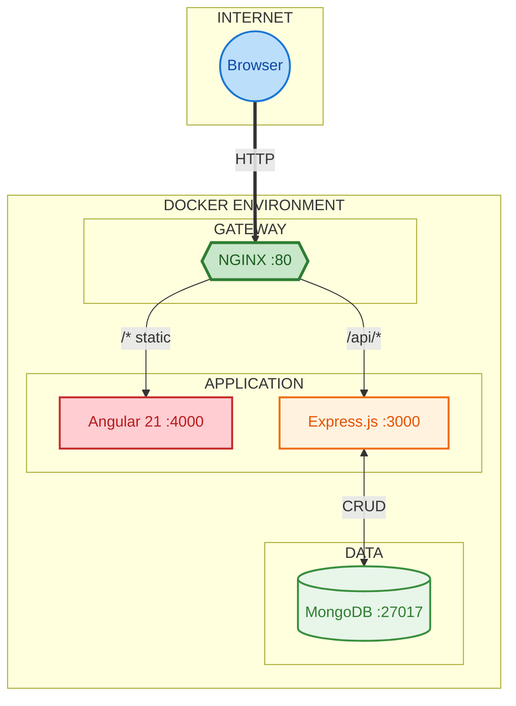
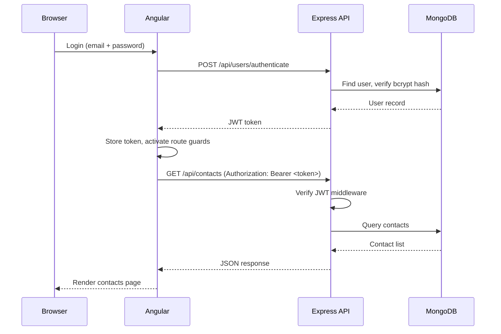
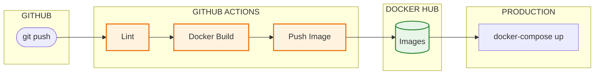
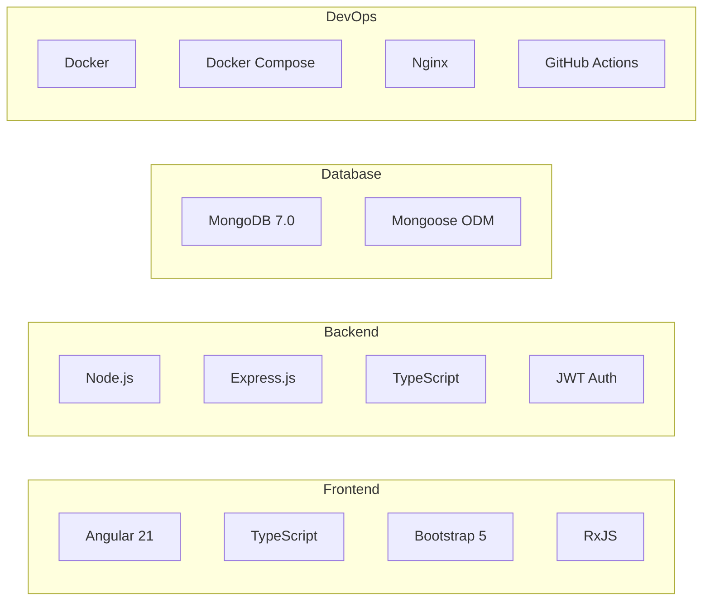

<div align="center">

# mean-stack-dockerized

**Production-grade contact manager built with the full MEAN stack and Docker**

MongoDB | Express.js | Angular 21 | Node.js | Docker | TypeScript

[Get Started](#getting-started) | [Docs](#documentation)

[](https://github.com/2015pushkar)

</div>

---

## About

A containerized full-stack contact management app built to learn and demonstrate production-level patterns: JWT auth, REST APIs, Nginx reverse proxy, Docker Compose, CI/CD, and TypeScript across the entire stack. The domain is simple by design so the focus stays on the architecture.

---

## Architecture



---

## Auth Flow



---

## CI/CD Pipeline



---

## Tech Stack



---

## Getting Started

**Prerequisites:** Docker and Docker Compose, Git

```bash
git clone https://github.com/2015pushkar/mean-stack-dockerized
cd mean-stack-dockerized
cp .env.example .env
docker-compose -f docker-compose.nginx.yml up
```

Open [http://localhost](http://localhost) in your browser.

**Default login**

```
Email:    pushkarwani63@gmail.com
Password: P@ssword#321
```

---

## Deployment Modes

| Mode | Command | Access |
|------|---------|--------|
| Development (3 containers) | `docker-compose up` | Frontend :4000, API :3000 |
| Production (4 containers + Nginx) | `docker-compose -f docker-compose.nginx.yml up` | http://localhost |

---

## Features

| Area | Capabilities |
|------|-------------|
| Auth | Register, login, JWT-protected routes, change password |
| Contacts | Create, read, update, delete, search, sort, paginate |
| UI | Responsive Bootstrap 5, form validation, Angular route guards |
| API | RESTful Express.js with middleware and Mongoose ODM |

---

## Documentation

| Document | Description |
|----------|-------------|
| [Frontend](frontend/README.md) | Angular architecture and components |
| [Backend API](api/README.md) | Express.js endpoints and middleware |
| [Database](docs/mongo-readme.md) | MongoDB schemas and seed data |
| [Load Balancer](loadbalancer/README.md) | Nginx routing config |
| [Local Dev](docs/local-devlopment.md) | Running without Docker |
| [Docker Guide](docs/docker-guide.md) | Container setup |

---

## Roadmap 2026

| Quarter | Focus |
|:-------:|-------|
| Q1 | Unit tests, E2E with Cypress, CI coverage reporting |
| Q2 | Angular Material, dark/light theme |
| Q3 | RBAC (Admin/Manager/User), OAuth 2.0 |
| Q4 | Redis caching, rate limiting, Kubernetes |

---

## License

MIT. See [LICENSE](LICENSE).

<div align="center">

Built by [Pushkar Wani](https://github.com/2015pushkar)

</div>
